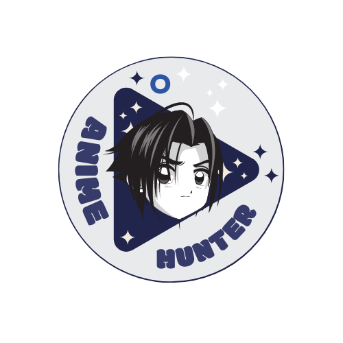
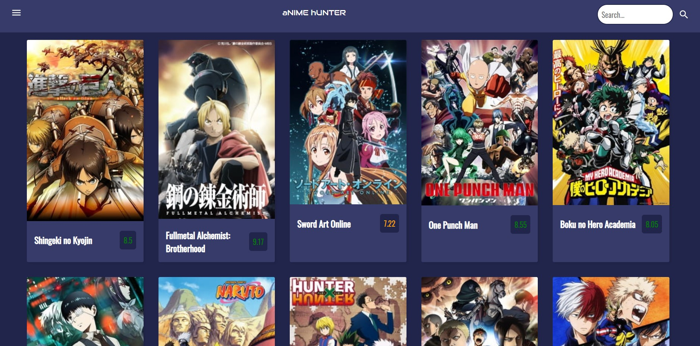

<!-- ALL-CONTRIBUTORS-BADGE:START - Do not remove or modify this section -->

<!-- ALL-CONTRIBUTORS-BADGE:END -->

# :pushpin: Anime Hunter

The app lets you search for the top anime from every genre available in the web-app. It also provides user with the rating of the anime.

Live demo: [Anime Hunter](https://www.animehunter.tech/)

## :pushpin: Setup Development Envionment

**Step 1.** Fork the repo

**Step 2.** Clone the repo using

      $ git clone <your_forked_repo_link>

**Step3.** Navigate to project folder

      $ cd animehhunter

**Step 4.** Run the following command in terminal

      $ npm install

## :scroll: Contribution Guidelines

Remember to follow our [Code Of Conduct](https://github.com/Vivek-Py/animehhunter/blob/main/CODE_OF_CONDUCT.md)

**Step 1.** Make a new branch related to your work/issue

      $ git checkout -b <your_branch_name>

**Step 2.** Make your changes & commit it with a suitable small message

      $ git add . && git commit -m"your_message"

**Step 3.** Add upstream to repo

      $ git remote add upstream https://github.com/Vivek-Py/animehhunter.git

**Step 4.** Update your local repo with main repo

      $ git fetch upstream && git merge upstream/main

**Step 5.** Push your code to your forked repo & make a Pull Request from GitHub

      $ git push origin <your_changes_containing_branch_name>

## :scroll: Available Scripts

In the project directory, you can run:

      $ npm start

Runs the app in the development mode.\
Open [http://localhost:3000](http://localhost:3000) to view it in the browser.

The page will reload if you make edits.\
You will also see any lint errors in the console.

      $ npm test

Launches the test runner in the interactive watch mode.\
See the section about [running tests](https://facebook.github.io/create-react-app/docs/running-tests) for more information.

      $ npm run build

Builds the app for production to the `build` folder.\
It correctly bundles React in production mode and optimizes the build for the best performance.

The build is minified and the filenames include the hashes.\
Your app is ready to be deployed!

See the section about [deployment](https://facebook.github.io/create-react-app/docs/deployment) for more information.

      $ npm run eject

**Note: this is a one-way operation. Once you `eject`, you can’t go back!**

If you aren’t satisfied with the build tool and configuration choices, you can `eject` at any time. This command will remove the single build dependency from your project.

Instead, it will copy all the configuration files and the transitive dependencies (webpack, Babel, ESLint, etc) right into your project so you have full control over them. All of the commands except `eject` will still work, but they will point to the copied scripts so you can tweak them. At this point you’re on your own.

You don’t have to ever use `eject`. The curated feature set is suitable for small and middle deployments, and you shouldn’t feel obligated to use this feature. However we understand that this tool wouldn’t be useful if you couldn’t customize it when you are ready for it.

## :pushpin: Our Team

    

      

_This project is upgraded under MLH Hacktoon 2022 season_

## License

[MIT License](https://github.com/Vivek-Py/animehhunter/blob/main/LICENSE.md)

## Contributors ✨

Thanks goes to these wonderful people ([emoji key](https://allcontributors.org/docs/en/emoji-key)):

<!-- ALL-CONTRIBUTORS-LIST:START - Do not remove or modify this section -->
<!-- prettier-ignore-start -->
<!-- markdownlint-disable -->
<table>
  <tr>
    <td align="center"><a href="https://github.com/Innanov"> <b>INNAN Nouhaila</b></a> <a href="#design-Innanov" title="Design">🎨</a></td>

    <td align="center"><a href="https://github.com/Prastab"> <b>Prastab</b></a> <a href="https://github.com/Vivek-Py/animehhunter/commits?author=Prastab" title="Documentation">📖</a> <a href="#plugin-Prastab" title="Plugin/utility libraries">🔌</a></td>

    <td align="center"><a href="https://www.linkedin.com/in/rishabh-sde/"> <b>Rishabhraghwendra18</b></a> <a href="https://github.com/Vivek-Py/animehhunter/commits?author=Rishabhraghwendra18" title="Documentation">📖</a></td>

  </tr>
</table>

<!-- markdownlint-restore -->
<!-- prettier-ignore-end -->

<!-- ALL-CONTRIBUTORS-LIST:END -->

This project follows the [all-contributors](https://github.com/all-contributors/all-contributors) specification. Contributions of any kind welcome!